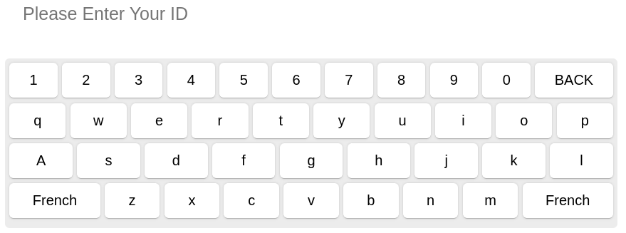
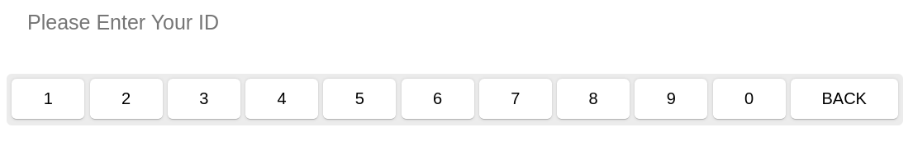
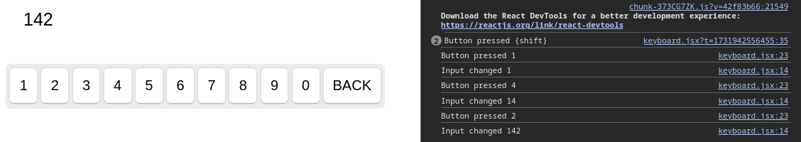
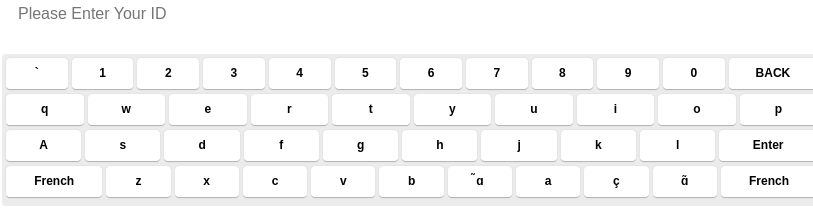
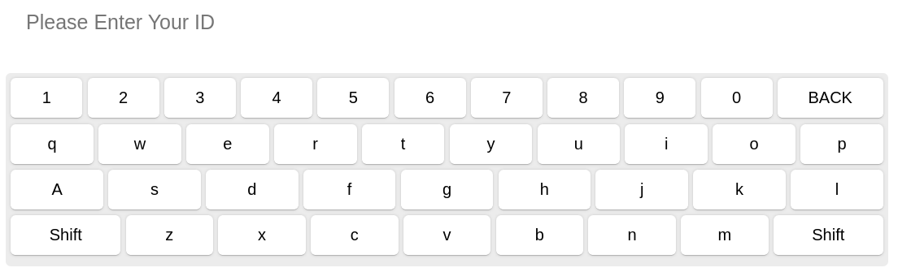
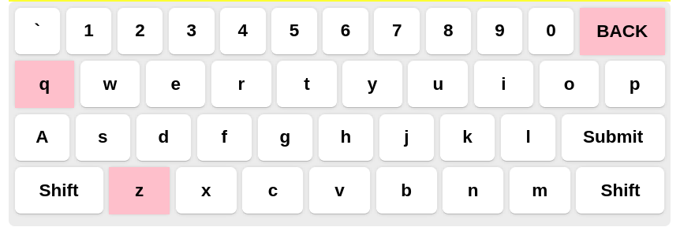

# React Keyboard Library Documentation

## Introduction

Currently under research/development. Not a final determination of if CIS is committing to the use of this 
library within next-gen.

Note: This is currently being written to use with JavaScript. This will eventually need to be converted into 
a TypeScript guide.

This document assumes you have basic React/Javascript Knowledge
- Needed to use the library within React: [NPM Installer Link](https://www.npmjs.com/package/react-simple-keyboard)
- Larger/Broad Library Documentation: [React-Library Documentation Link](https://hodgef.com/simple-keyboard/getting-started/react/)

## Installation
1. Create a new React Javascript build through your preferred method. Or use an existing playground project. 
I use vite to build.
2. Make sure you are within the correct directory with your `package.json` file and install the keyboard library.
    - `npm i react-simple-keyboard`
3. Create a new `keyboard.jsx` and copy from the entirety of the [component-code](#Component-Code) to add into the created file. 
We will use this to walk through the libraries capabilities.
4. Add the component into your main [App.jsx](#App) file.
5. Create a `styles.css` file within the same directory and copy the [styles](#Styles) text and paste in the below.
6. Command `npm run dev` to launch the app to test that the below appears. The French button in the below is an 
example of how we can switch out button text. It is actually the shift key in this image.
   - )

## KeyboardProperties
- All changes can be made directly within the `keyboard.jsx` file.
- Most properties you can change will be available with the `Keyboard` component.
- This portion of the code will be walked through for you to edit.
### Example
```
   <Keyboard
       keyboardRef={r => (keyboard.current = r)}
       layoutName={layout}
       onChange={onChange}
       onKeyPress={onKeyPress}
       layout={{
           'default': [
               '` 1 2 3 4 5 6 7 8 9 0 - = {bksp}',
               '{tab} q w e r t y u i o p [ ] \\',
               '{lock} A s d f g h j k l ; \' {enter}',
               '{shift} z x c v b n m , . / {shift}',
               '.com @ {space}'
           ],
           'shift': [
               '{shift} Z X C V B N M &lt; &gt; ? {shift}',
               'w e t'
           ]
       }}
       excludeFromLayout={
           {
               default: ["`", "-", "+", "=", "[", "]", "\\", "{lock}", ";", "'", "{enter}", ",", ".", "/", "{tab}", "{space}", "@", ".com"],
               shift: ["{space}", "@", ".com"],
           }
       }
       display={{
           '{bksp}': 'BACK',
           '{shift}': 'Shift',
       }}
       buttonTheme={[
            {
                class: "keys",
                buttons: "q z a {bksp}",
            },
        ]}
  ```

### Layout Prop
#### Default
   - Used to create the keyboard itself.
   - Ex: I can create the layout with just these lines.
- ```
    layout={{
        'default': [
            '` 1 2 3 4 5 6 7 8 9 0 - = {bksp}',
        ]
    }}
  ```
  - )
- If you also go into chrome and inspect the console, the library is tracking all the values entered.
  - )
#### Shift
- The shift in the layout section will define what the layout will be when the shift key is pressed.
    ```
    'shift': [
        '{shift} Z X C V B N M &lt; &gt; ? {shift}',
        'w e \u0046 '
    ]
    ```

### Excluding Certain Characters Prop
- If you'd like to keep keys within the default layout but exclude certain keys as necessary you can use the 
  `excludeFromLayout` prop.
- As you can see in the above [example](#example) that includes the prop, we are currently excluding a lot. 
  In the default we have all of those keys.
- You can also decide what to exclude on your shift layout as well.
- Please note the syntax in the above to test yourself. If we remove for example the `{enter}` key from the excludes 
  section, it will populate in the keyboard.
  - 
### Display Prop
- Within the Keyboard component, you will see a property labeled as `display`. If you follow the syntax correctly 
  you can replace any key with a different value.
- Ex: Changing the "French" key above into the "Shift" key.
- There are curly braces only under certain functional keys. If you want to change the letter `a` to `A`, you can omit 
the curly braces.
   ```
    display={{
        '{bksp}': 'BACK',
        '{shift}': 'Shift',
    }}
    ```
  - 
### buttonTheme
- Here we can change what our keys look like.
- Refer back to the example code again and see what we're doing for this property.
- We can make any changes we'd like based on what css class we give the property. That class is tied back to 
  your `styles.css` file we originally created.
- The css class must follow the name syntax below. You can add whatever name you'd like to the end, but for now 
it is just `keys`.<br/>

#### *styles.css*
```
.simple-keyboard.hg-layout-default .hg-button.keys{
    background: pink;
    color: black;
    border-radius: 0px;
    border: none;
}
```
- We see that we have these keys currently following the `keys` class. `buttons: "q z a {bksp}",`
  

## Button Functionality
- Any button can be given functionality by creating a comparison statement in the `onKeyPress` 
  variable depending on what was pressed. State is already being tracked so I really only recommend using the 
  functionality with the Enter (submit) button.
- Ex: If the button is the `{enter}` key, it will execute those console logs.
  - The `input` is the recorded value of what was typed into the keyboard
  - The `keyboard.current.setInput("")` will reset the input value back to an empty string for the next user to enter data.
    ```
    const onKeyPress = button => {
        if (button === "{shift}" || button === "{lock}") handleShift();
        if (button === "{enter}") {
            console.log(input);
            keyboard.current.setInput("");
        }
    }
    ```

## More on Styles
- Since localization will be an important part of why this library is useful. 
This is where we can get more technical and custom with our options.
- This section will include new code that has not been introduced.
### Input Section
- You can create a custom input section by defining the class in the `styles.css` file. Then within the keyboard.jxs 
  component, you can edit the `input` html tag.<br/>

*styles.css*
```
.englishInput {
  width: 100%;
  height: 100px;
  padding: 20px;
  font-size: 20px;
}
```
*keyboard.jsx*
```
<div className="App">
    <input
        value={input}
        placeholder={"Please Enter Your ID"}
        onChange={onChangeInput}
        className="englishInput"
    />
```
### Keyboard Custom Theme Container Background
- This is the parent to all the buttons within the keyboard.
- The `.simple-keyboard` class is the base class to then use custom themes on top of it. See the english theme below. <br/>

*styles.css*
```
.simple-keyboard {
    max-width: 1024px;
}

.simple-keyboard.englishTheme {
    background: rgb(255,0,0);
    background: linear-gradient(90deg, rgba(255,0,0,1) 0%, rgba(240,240,247,1) 37%, rgba(255,255,255,1) 49%, rgba(255,245,245,1) 58%, rgba(9,9,121,1) 100%);
    border-radius: 0;
    border-bottom-right-radius: 5px;
    border-bottom-left-radius: 5px;
}
```
- You can then pass `theme` as a prop like in the examples before. <br/>

*keyboard.jsx*
```
theme={
    "hg-theme-default hg-layout-default englishTheme"
}
```

### Custom Theme Buttons
- Now you can add on to the theme you just created by changing all the buttons themselves. If you inserted 
  the `englishTheme` as a prop in the before example. The buttons will now change as well.  

*styles.css*
```
.simple-keyboard.englishTheme .hg-button {
    height: 50px;
    display: flex;
    justify-content: center;
    align-items: center;
    background: grey;
    color: white;
}
```

### Creating these themes will be very useful if you need to make different styles depending on what on-screen keyboard display you might need.

## Component-Code
```
import React, { useRef, useState } from "react";
import Keyboard from "react-simple-keyboard";
import "./styles.css"
import "react-simple-keyboard/build/css/index.css";

export default function keyboard() {

    const [input, setInput] = useState("");
    const [layout, setLayout] = useState("default");
    const keyboard = useRef();
    const onChange = input => {
        setInput(input);
        console.log("Input changed", input);
    };

    const handleShift = () => {
        const newLayoutName = layout === "default" ? "shift" : "default";
        setLayout(newLayoutName);
    };

    const onKeyPress = button => {
        console.log("Button pressed", button);

        /**
         * If you want to handle the shift and caps lock buttons
         */
        if (button === "{shift}" || button === "{lock}") handleShift();
    };

    const onChangeInput = event => {
        const input = event.target.value;
        setInput(input);
        keyboard.current.setInput(input);
    };

    return (
        <div className="App">
            <input
                value={input}
                placeholder={"Please Enter Your ID"}
                onChange={onChangeInput}
            />
            <Keyboard
                keyboardRef={r => (keyboard.current = r)}
                layoutName={layout}
                onChange={onChange}
                onKeyPress={onKeyPress}
                layout={{
                    'default': [
                        '` 1 2 3 4 5 6 7 8 9 0 - = {bksp}',
                        '{tab} q w e r t y u i o p [ ] \\',
                        '{lock} A s d f g h j k l ; \' {enter}',
                        '{shift} z x c v b n m , . / {shift}',
                        '.com @ {space}'
                    ],
                    'shift': [
                        '{shift} Z X C V B N M &lt; &gt; ? {shift}',
                        'w e t'
                    ]
                }}
                excludeFromLayout={
                    {
                        default: ["`", "-", "+", "=", "[", "]", "\\", "{lock}", ";", "'", "{enter}", ",", ".", "/", "{tab}", "{space}", "@", ".com"],
                        shift: ["{space}", "@", ".com"],
                    }
                }
                display= {{
                    '{bksp}': 'BACK',
                    '{shift}': 'Shift',
                    '{enter}': `Submit`
                }}
                buttonTheme={[
                    {
                        class: "keys",
                        buttons: "q",
                    },
                ]}
            />
        </div>
    );
}
```
## App
```
import Keyboard from './components/keyboard'

function App() {
  return (
    <>
      <Keyboard/>
    </>
  )
}

export default App```
```
## Styles
```
input {
    width: 100%;
    height: 100px;
    padding: 20px;
    font-size: 20px;
    border: yellow;
    background-color: yellow;
    box-sizing: border-box;
    color: black;
  }
  
  .simple-keyboard {
    max-width: 1024px;
    margin: 0px;
    background-color: transparent;
    border-radius: 20px;
  }

.simple-keyboard.hg-layout-default .hg-button.keys{
    background: pink;
    color: black;
    border-radius: 0px;
    border: none;
}
```